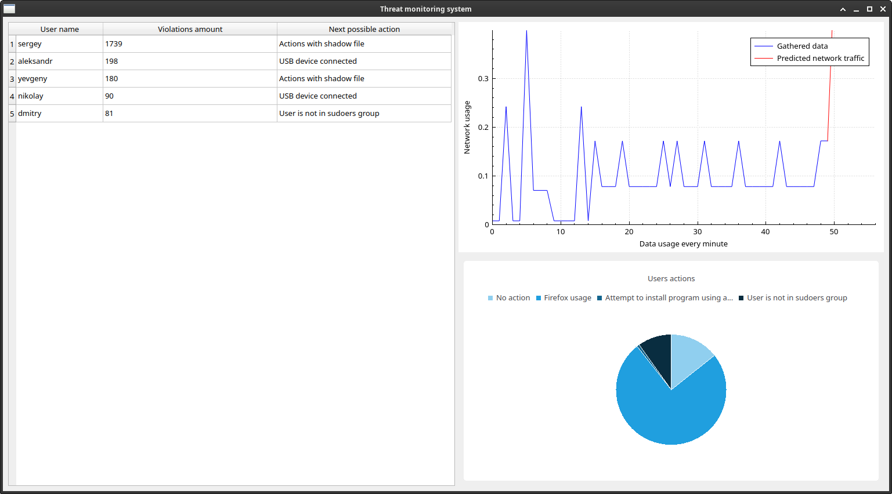

# Threat-monitoring

The internal threats monitoring system based on the network traffic and user activity prediction.

> [!WARNING]

> This program is a prototype, and used for showing basic functionality, not intended to be used in production.

## Contents

1. [Algorithm](#1-algorithm)
2. [Dependencies](#2-dependencies)
3. [Prerequisites](#3-prerequisites)
4. [Usage](#4-usage)
5. [Testing](#5-testing)

### 1. Algorithm

This monitoring system uses two main algorithms:

- ARIMA - is used in detection of the user's network traffic load;
- The neural network based on MLP - user's actions' prediciton.

### 2. Dependencies

This project uses following external libraries:

- mlpack;
- fmt;
- ctsa;
- qcustomplot;
- dotenv-cpp.

These files needs to be cloned directly from github repositories and builded in *external* folder.

The monitoring system also depends on a relational database PostgreSQL.

Other external libraries can be installed using repository:

```sh
sudo apt install \
  libqt6sql6-psql \
  libqt6charts6 \
  cereal \
  libarmadillo-dev \
  libcereal-dev \
  openssl \
  libfmt-dev \
  libpqxx-dev
```

### 3. Prerequisites

To use the program it is needed to execute sql script *tables_structure.pgsql* located in the folder *agent*.

This script contains commands which are needed for creating a database, tables and users' accounts. These accaunts are created for getting access only into the needed tables in the database. User names and their passwords could be changed to the preferred one.

### 4. Usage

The monitoring system consist of three parts:

- Agent - gathers date from the user's host and sends it to the database;
- Server - predicts user's actions and the network traffic load with the info from the database;
- Monitor - visualises that gathered data from the *Agent* module and predicted from the *Server* part, for comparison info between them and making decisions about possible internal threats.

The *Agent* module can be launched by using the following command:

```sh
    sudo ./Agent [database-host] [database-port] [username] [database-name] [interface]
```

The *Server* module is launched using the same parameters in the previous command:

```sh
    sudo ./Server [database-host] [database-port] [username] [database-name] [interface]
```

After using this prompt these programs will ask for password input.

The monitor program takes the similar parameters for the input and connects to the database next.
A user interface visualizes the gathered and predicted users network traffic with their actions mutually. The next picture shows the module *Monitor* in action:



### 5. Testing

This program can be tested using unit tests, which are available in the folder *tests*. For launching it CTest and GTest must be installed on the operating system.

For simulating malicious events auditd is needed to be installed and rules according to *malicious_events.sh* file, located in root folder to be created.
